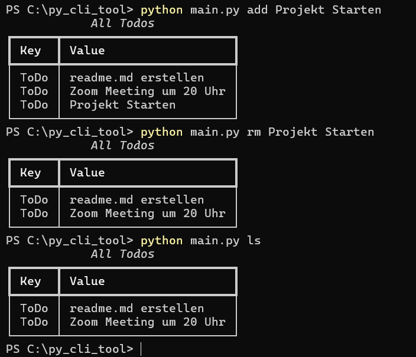
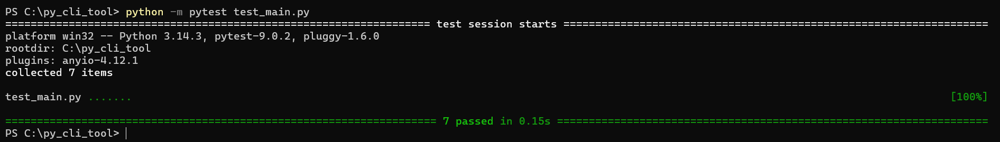

# 📝 Todo CLI Tool

A simple command-line Todo manager built with Python and Rich.



---

## ✨ Features

- Add, list, and remove todos from your terminal
- Table output with `rich`
- Error logging to `logs.txt`
- Works on Windows. macOS? Linux?

---

## 📦 Installation

```bash
git clone https://github.com/erkmenberat/Python_CLI_Tool.git
pip install -e .
```

---

## 🚀 Usage

```bash
todo add Milch kaufen
todo ls
todo rm Milch kaufen
todo --help
```
---

## 🛠️ Tech Stack

- Python 3.11+
- [Rich](https://github.com/Textualize/rich) — Terminal formatting
- pathlib — File handling
- pytest — Unit tests

---

## 🧪 Tests

```bash
pip install pytest
pytest
```



---

## by Berat ERKMEN